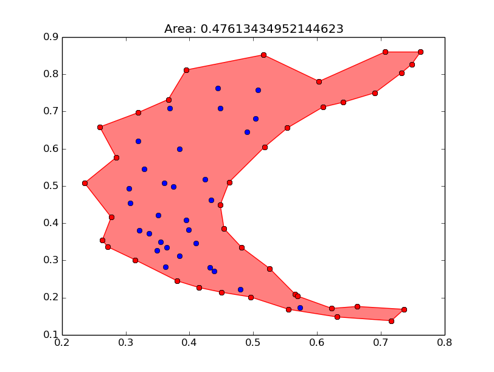

Alpha Shapes
============

Credits
-------
The main python script is based on the Stack Overflow question [here](http://stackoverflow.com/questions/6833243/how-can-i-find-the-alpha-shape-concave-hull-of-a-2d-point-cloud)

This [post](http://bocoup.com/weblog/compiling-clarksons-hull-in-os-x/) helped in solving an installation issue.

Requirements
-------------
- C compiler

Installation
-------------
1. Download source code from [here](http://www.netlib.org/voronoi/hull.zip)
2. Replace the stormacs.h file with [this one](http://bocoup.com/weblog/wp-content/uploads/2010/03/stormacs.h)
3. Run `make`

Example
-----
        
        >>> import hull
        >>> import matplotlib.pyplot as plt
        >>> import os
        >>> with open(os.path.join('examples', 'cshape-full')) as f:
        ...     points = [tuple([float(i) for i in line.rstrip().split()]) for line in f]
        >>> fig, ax = plt.subplots()
        >>> ax.plot([point[0] for point in points], [point[1] for point in points], 'bo')
        >>> for point_i, point_j in hull.get_alpha_shape(points):
        ...     ax.plot([point_i[0], point_j[0]], [point_i[1], point_j[1]], 'ro-')
        >>> plt.show()

